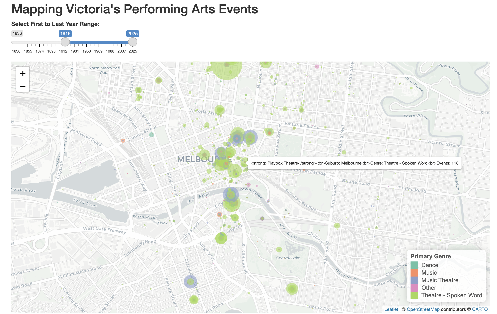
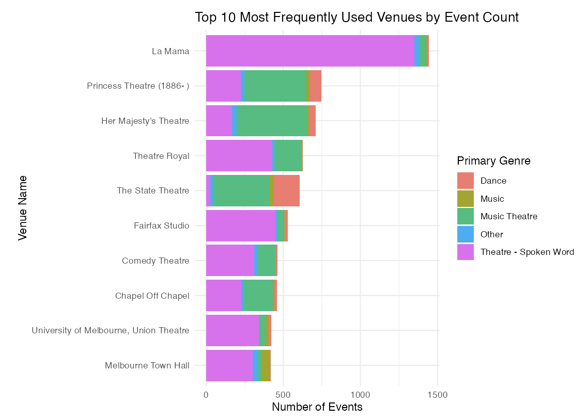

# 🎭 Mapping Victoria's Performing Arts Events

This repository contains my R Shiny project for exploring performing arts events across Victoria using the AusStage dataset. The project combines an interactive Leaflet map with a static bar chart to highlight venue activity, genre patterns, and event distribution over time.

---

## 📌 Introduction

This project visualises performing arts events in Victoria by focusing on where events were held, how frequently venues were used, and which genres were most prominent. The application was developed in R Shiny and includes two main visual components.

The first is an interactive map that displays venue-genre combinations across Victoria, with marker size representing the number of unique events and marker colour representing the primary genre. The second is a bar chart showing the top 10 most frequently used venues by event count, broken down by genre.

Together, these visualisations help reveal spatial and categorical patterns in Victoria’s performing arts landscape.

---

## 💡 Motivation

Performing arts data can be difficult to interpret from raw tables alone, especially when trying to understand both geographic spread and venue popularity. This project was motivated by the need to present that information in a more accessible and visual way.

By combining a map with a ranked bar chart, the project makes it easier to explore questions such as:
- where performing arts activity is concentrated
- which venues host the largest number of events
- how genre distributions differ across venues
- how event patterns change across different year ranges

---

## 📊 Key Visualisations

### 1. Interactive Map of Performing Arts Venues



This interactive Leaflet map visualises venue-genre combinations across Victoria. Circle size is scaled using the square root of the number of unique events, while colour represents the primary genre. The year-range slider allows users to filter events by `First.Year` and `Last.Year`, and hovering over a marker reveals the venue name, suburb, genre, and event count. The app is centered on Melbourne and includes a genre legend for interpretation. :contentReference[oaicite:2]{index=2} :contentReference[oaicite:3]{index=3}

### 2. Top 10 Most Frequently Used Venues by Event Count



This horizontal stacked bar chart compares the top 10 venues by total event count. Each bar is segmented by primary genre, allowing both venue popularity and genre composition to be examined at the same time. The server code computes unique event counts by venue and genre, identifies the top 10 venues by total events, and orders them from highest to lowest for readability. :contentReference[oaicite:4]{index=4} :contentReference[oaicite:5]{index=5}

---

## 🔍 Project Highlights

- Built an interactive Shiny dashboard in R
- Used a year-range slider to filter events over time
- Created a Leaflet map centered on Melbourne
- Sized map markers by event frequency
- Coloured markers by primary genre
- Added interactive hover labels showing venue details
- Built a static stacked bar chart of the top 10 venues
- Compared venue popularity and genre breakdown in one view
- Used the AusStage dataset as the underlying data source :contentReference[oaicite:6]{index=6}

---

## 🧪 Methods Used

### Interactive Visualisation
- **R Shiny** for dashboard structure and interactivity
- **Leaflet** for the interactive venue map
- **Slider filtering** for temporal exploration
- **Tooltip labels** for contextual venue information

### Data Aggregation and Visual Analysis
- Grouped data by venue and primary genre
- Counted distinct events for each venue-genre combination
- Identified top 10 venues by total event count
- Used a stacked horizontal bar chart for ranked comparison :contentReference[oaicite:7]{index=7}

---

## 🛠️ Tools and Libraries

- **R**
- **shiny**
- **leaflet**
- **ggplot2**
- **dplyr**
- **RColorBrewer** :contentReference[oaicite:8]{index=8} :contentReference[oaicite:9]{index=9}

---

## 📁 Files

- `ui.R` — user interface for the Shiny app, including the title, year-range slider, map output, chart output, descriptions, and data source note :contentReference[oaicite:10]{index=10}
- `server.R` — server logic for preprocessing data, generating the top 10 venue chart, filtering by year range, aggregating venue data, and rendering the interactive map :contentReference[oaicite:11]{index=11}
- `Screenshot 2026-04-10 at 1.17.59 am.png` — interactive map visualisation
- `Screenshot 2026-04-10 at 1.18.21 am.png` — top 10 venue bar chart
- `AusStage_S12025PE2v2.csv` — dataset used in the project

---

## ▶️ How to Run the Code

1. Open the project folder in **RStudio**
2. Make sure `ui.R`, `server.R`, and `AusStage_S12025PE2v2.csv` are in the same working directory
3. Install the required packages if needed
4. Run the Shiny app

```r
install.packages(c("shiny", "leaflet", "ggplot2", "dplyr", "RColorBrewer"))
shiny::runApp()
